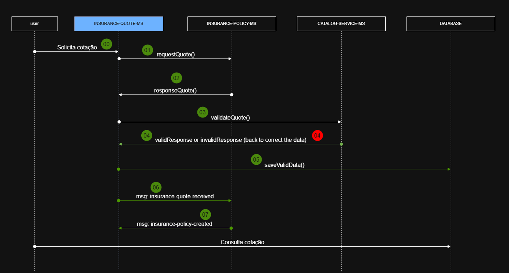

# INSURANCE QUOTE MICROSERVICE


> ## Introdução
- Projeto desenvolvido com o intuito de implementar um microsserviço de cotação de seguros. 

> ## Sobre o Projeto
- O Insurance Quote Microservice é um sistema que permite criar cotações de seguros com base em produtos e ofertas fornecidos por um serviço externo (catalog-service-ms/ mockserver). O Microsserviço deve validar as requisições, persistir os dados em um banco de dados, e publica mensagens em filas para comunicação com outros sistemas.

> ## Tecnologias/ Ferramentas
- Java 17 + Maven
- Spring Boot
- RabbitMQ
- Docker e Docker Compose
- MockServer
- PostgreSQL
- Jackson
- MapStruct
- SLF4J

> ## Arquitetura
### Escolha da Arquitetura Hexagonal (Clean Architecture)
A arquitetura foi escolhida para garantir modularidade e independência, pois permite:

- Isolar a lógica de negócio de frameworks, que permite substituir tecnologias sem impacto no sistema;
- Separar responsabilidades. Cada camada tem um propósito claro, promovendo coesão e reduzindo o acoplamento;
- Facilitar implementação dos testes unitários;
- Adicionar novos endpoints ou integrações.

### Estrutura das Camadas

1. **Domain**: Contém entidades e regras de negócio
2. **Application:** Conecta o domain aos adaptadores externos
3. **Interfaces:** Atua como 'ponte' entre o ambiente externo e a lógica interna
4. **Infrastructure:** Implementa detalhes técnicos e configurações

>## Diagrama de Atividades



>## Decisões e Premissas Técnicas
#### 1. PostgreSQL
- Banco de dados definido por ser um relacional robusto, ideal para modelar dados com normalização
- Suporte a consultas complexas
- Boa integração com o Spring Data JPA

### 2. RabbitMQ
- Escolhido porque suporta filas robustas e confiáveis, garantindo que as mensagens sejam entregues mesmo em caso de falhas temporárias
- Permite que o microsserviço escale horizontalmente
- Boa integração com o Spring AMQP

### 3. Records para DTOS
- Foram adotados por sua imutabilidade e concisão

### Tratamento de Exceções
- Definida para retornar respostas HTTP com mensagens claras

>## Instruções para Executar o Projeto
### Pré-requisitos
- Docker instalado
- Java 17
- Maven

1. Clone o repositório
```bash
git clone https://github.com/giselle-ferreira/java-spring-insurance-ms.git
```

2. Suba os contêineres
```bash
docker compose up -d --build
```

3. Verifique os logs
```bash
docker compose logs insurance-quote-ms
```

4. Teste o endpoint `POST/quotes`
```bash
curl -X POST http://localhost:8081/quotes \
-H "Content-Type: application/json" \
-d '{
    "product_id": "1b2da7cc-b367-4196-8a78-9cfeec21f587",
    "offer_id": "adc56d77-348c-4bf0-908f-22d402ee715c",
    "category": "HOME",
    "total_monthly_premium_amount": 75.25,
    "total_coverage_amount": 825000.00,
    "coverages": {
        "Incêndio": 250000.00,
        "Desastres naturais": 500000.00,
        "Responsabiliadade civil": 75000.00
    },
    "assistances": ["Encanador", "Eletricista", "Chaveiro 24h"],
    "customer": {
        "document_number": "36205578900",
        "name": "John Wick",
        "type": "NATURAL",
        "gender": "MALE",
        "date_of_birth": "1973-05-02",
        "email": "johnwick@gmail.com",
        "phone_number": 11950503030
    }
}'
```

5. Para parar os contêineres
```bash
docker compose down
```

🚨 Observação: O endpoint pode retornar erros devido a validações incompletas (ex.: `NullPointerException` no `CatalogServiceClient`). 
Investigações em andamento.

<br>

>## Próximos passos
- Testes unitários e de integração: implementação com JUnit e Mockito
- Cobertura de testes com JaCoCo
- Correção de inconsistências
- Exception Handlers
- Observabilidade

<br>

Giselle Ferreira | 2025